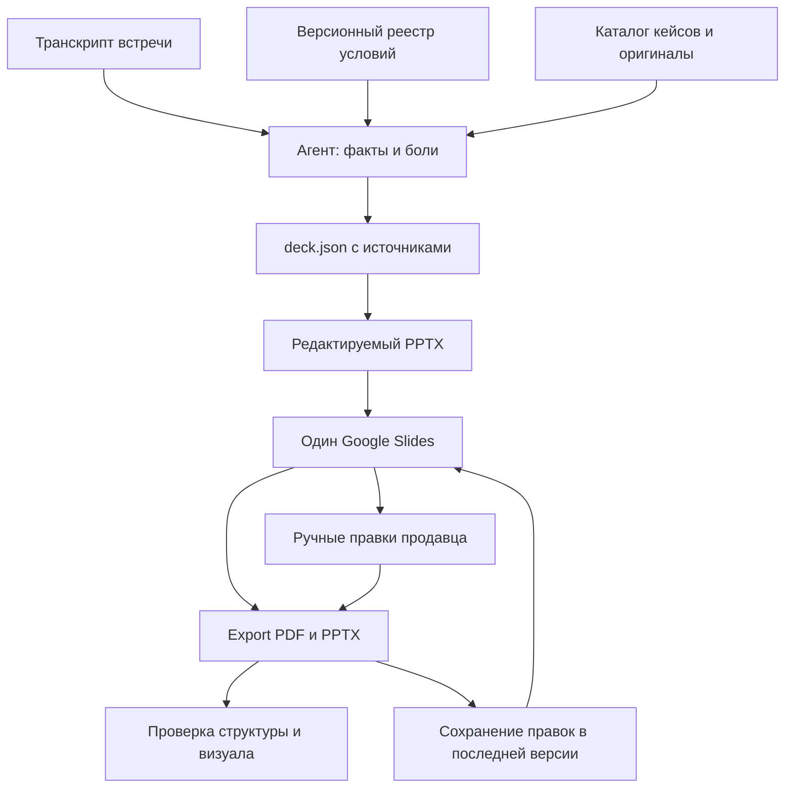

# Архитектура

Google-запись выполняется только после Drive.about: dep6.2. Секреты остаются в штатном credential store. Оригиналы кейсов включены в закрытый пакет и проверяются SHA256. Текстовые кейсы явно отделены от кейсов с изображением. Весь архив Telegram, личные Downloads и сырьё продавцам не нужны.

Общая метка встречи хранится в Drive `properties`, доступной разным OAuth-клиентам, а не только private `appProperties`. Legacy appProperties поддерживаются при чтении. Основание: https://developers.google.com/workspace/drive/api/guides/properties . Старые презентации другого скилла не захватываются автоматически; этот пакет обновляет только свои помеченные файлы.

Для повторной правки нужен baseline из export, hash экспортированного PPTX и свежий modifiedTime. Запись останавливается при изменении версии. Это optimistic check, не распределённая блокировка; одновременно одну встречу не обновлять. Исходный run key не менять. При нескольких совпадениях или неполном поиске новый файл не создаётся.

Обновление сложного существующего дизайна выполняет агент на экспортированном PPTX. Для точных замен отдельных текстовых элементов есть `scripts/patch.mjs`; он сохраняет остальные OOXML-объекты. Факт сохранения смысловых ручных правок проверяет агент, а не только hash.

## Границы автоматизации

- Структурные тесты не доказывают истинность текста: агент сверяет транскрипт и условия.
- Визуальный просмотр не заменяется PDF page count.
- Новые цены не «утверждаются» самим ИИ; владелец обновляет каталог и выпускает новую версию.
- В пакете нет общих пользовательских токенов. Доступы GitHub и Google подтверждает соответствующий пользователь/администратор.
- Для первой установки нужен выполняющий команды агент. Windows/Linux предусмотрены, но в этом выпуске не испытаны на реальных машинах продавцов.
